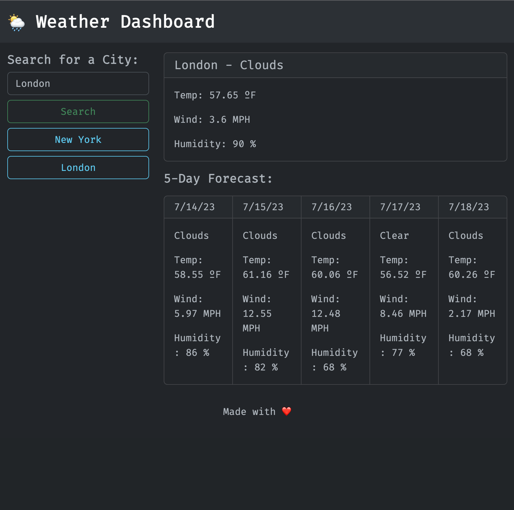

# weather-dashboard

Server-Side APIs Challenge: Weather Dashboard

## GitHub Pages

https://manc1n1.github.io/weather-dashboard

## Description

A weather dashboard that searches the https://openweathermap.org/ API for the weather in the location you look up. Shows Current data and 5-Day Forecast. Saves past searched locations for quick lookups.

## Usage

Search a location and get the weather data.

## Credits

-   https://openweathermap.org/
-   https://getbootstrap.com/

---

## Badges

